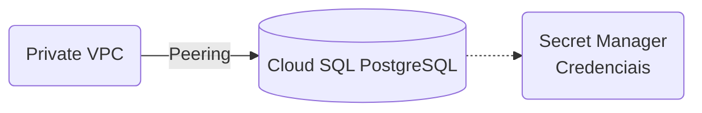

# Oficina Mecânica - Infraestrutura de Banco de Dados

## Propósito
Gerenciar e provisionar o banco de dados principal do sistema em modalidade "Gerenciada", garantindo isolamento de VPC, Backups Automáticos e armazenamento das credenciais com segurança.

## Tecnologias Utilizadas
- **Terraform**
- **Google Cloud SQL (PostgreSQL 16)**
- **Google Secret Manager**

## Passos para Execução e Deploy

**Execução e Deploy:**
A infraestrutura é provisionada automaticamente pelo GitHub Actions.
Para plano local:
1. `terraform init`
2. `terraform plan -var-file=environments/main.tfvars`

## Diagrama de Arquitetura

## APIs e Documentação
**Não aplicável.** Repositório de provisionamento de recursos PaaS, sem endpoints públicos de software.
