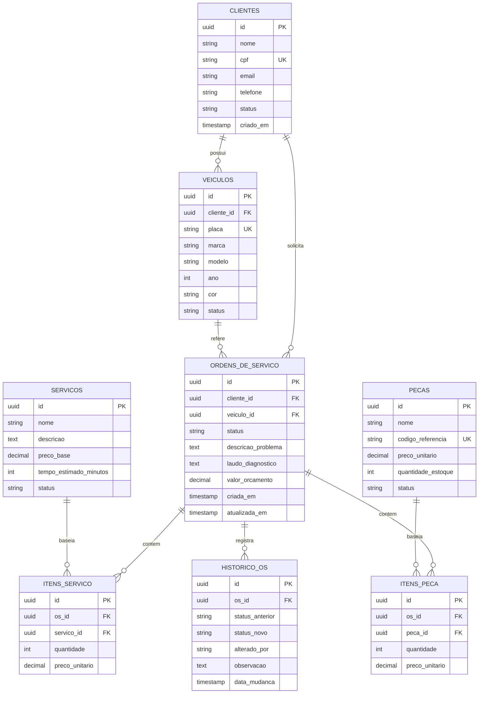

# Diagrama Entidade-Relacionamento (ER)

O modelo relacional da aplicação atende aos domínios de **Atendimento**, **Catálogo**, **Estoque**, **Identidade** e **Relatórios**.

```mermaid
erDiagram
    CLIENTES ||--o{ VEICULOS : possui
    CLIENTES ||--o{ ORDENS_DE_SERVICO : solicita
    VEICULOS ||--o{ ORDENS_DE_SERVICO : refere
    ORDENS_DE_SERVICO ||--o{ ITENS_SERVICO : contem
    ORDENS_DE_SERVICO ||--o{ ITENS_PECA : contem
    ORDENS_DE_SERVICO ||--o{ HISTORICO_OS : registra
    SERVICOS ||--o{ ITENS_SERVICO : baseia
    PECAS ||--o{ ITENS_PECA : baseia

    CLIENTES {
        uuid id PK
        string nome
        string cpf UK
        string email
        string telefone
        string status
        timestamp criado_em
    }

    VEICULOS {
        uuid id PK
        uuid cliente_id FK
        string placa UK
        string marca
        string modelo
        int ano
        string cor
        string status
    }

    ORDENS_DE_SERVICO {
        uuid id PK
        uuid cliente_id FK
        uuid veiculo_id FK
        string status
        text descricao_problema
        text laudo_diagnostico
        decimal valor_orcamento
        timestamp criada_em
        timestamp atualizada_em
    }

    HISTORICO_OS {
        uuid id PK
        uuid os_id FK
        string status_anterior
        string status_novo
        string alterado_por
        text observacao
        timestamp data_mudanca
    }

    SERVICOS {
        uuid id PK
        string nome
        text descricao
        decimal preco_base
        int tempo_estimado_minutos
        string status
    }

    PECAS {
        uuid id PK
        string nome
        string codigo_referencia UK
        decimal preco_unitario
        int quantidade_estoque
        string status
    }

    ITENS_SERVICO {
        uuid id PK
        uuid os_id FK
        uuid servico_id FK
        int quantidade
        decimal preco_unitario
    }

    ITENS_PECA {
        uuid id PK
        uuid os_id FK
        uuid peca_id FK
        int quantidade
        decimal preco_unitario
    }
```
